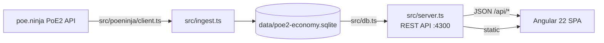

#  PoE2 Economy Tracker

Personal ingestion pipeline and dashboard for **Path of Exile 2** economy data.
Snapshots currency exchange rates and unique-item valuations from
[poe.ninja](https://poe.ninja)'s PoE2 economy API into a local SQLite database,
surfaces trends and flip opportunities through a rich Angular dashboard.

> Built on extensive research into GGG's official developer API, poe.ninja's
> data model, and the PoE2 tooling ecosystem — see [docs/](docs/README.md).

---

## 🏗 Architecture



- **Backend**: Zero-dependency Node 24 — native TypeScript execution, `node:sqlite`, `node:http`. No build step, no ORM, no framework.
- **Frontend**: Angular 22 standalone components with signal inputs/outputs, `effect()`, `inject()`, and `takeUntilDestroyed()`. Chart.js hand-wrapped (no `ng2-charts`).
- **Database**: Single SQLite file tracking every snapshot ever taken — two tables, 14 currency types, 9 unique-item categories.

## 🚀 Quick Start

**Requirements**: Node.js 24+

```sh
# 1. Ingest your first snapshot (poe.ninja refreshes ~hourly)
npm run ingest

# 2. Download item/currency icons (re-run after new leagues)
npm run fetch-assets

# 3. Build & launch the dashboard
npm run build:web
npm start                # → http://localhost:4300
```

```sh
# For frontend dev with hot reload:
npm run server           # terminal 1
npm run dev:web          # terminal 2 (proxies /api → :4300)

# Quick CLI report without the browser:
npm run query
```

## 📊 Dashboard

Five views at `http://localhost:4300`:

| View | Purpose |
|---|---|
| **Guide** | 8 researched money-making strategies tied directly to dashboard signals, plus a pre-flip checklist and signals reference |
| **Overview** | Market pulse: divine exchange rate & trend, market breadth, top gainers/losers, volume leaders, volatility ranking, category heat |
| **Currency** | Sortable table of all 14 currency types with inline sparklines, click-through to full history charts |
| **Unique Items** | Same, filterable by category and listing count, with search across all items |
| **Flip Finder** | Three liquidity-stratified discovery strategies: high-volume currency churn, liquid item flipping, and scarce-item sniping |

A global toggle  **Exalted** /  **Chaos** /  **Divine** switches display denomination
everywhere — values are stored in divine, rates are derived from the snapshot
itself. Smart precision adapts from thousands-separated integers down to 2
significant figures for sub-0.01 values.

## 🔌 API Reference

All endpoints are `GET`, CORS-open, JSON. No auth — localhost-only.

| Endpoint | Key params | Description |
|---|---|---|
| `/api/meta` | — | League name, category lists for UI filters |
| `/api/summary` | — | Latest snapshot stats, divine rates, row counts |
| `/api/currency` | `type?`, `fetchedAt?` | All currencies for a category, with parsed sparklines |
| `/api/currency/history` | `id` | Full time series for one currency across all snapshots |
| `/api/items` | `type?`, `sort?`, `dir?`, `limit?`, `maxListings?` | Unique items, sortable & filterable |
| `/api/items/history` | `id` | Full time series for one item |
| `/api/flips` | `minChange?`, `maxListings?`, `minVolume?`, `limit?` | Three flip-discovery strategies (see dashboard) |
| `/api/insights` | `fetchedAt?` | Derived analytics: rates, breadth, volatility, gainers/losers, volume leaders, category pulse |

See [docs/10-implementation.md](docs/10-implementation.md) for the full schema and query semantics.

## 📁 Project Structure

```
poe/
├── src/
│   ├── ingest.ts          # poe.ninja → SQLite snapshot pipeline
│   ├── server.ts           # REST API + static dashboard server
│   ├── db.ts               # SQLite read helpers
│   ├── config.ts           # League, categories, poe.ninja endpoints
│   ├── fetch-assets.ts     # Icon downloader (trade-site static metadata)
│   ├── query.ts            # CLI report
│   └── poeninja/           # poe.ninja API client + types
├── web/                    # Angular 22 dashboard
│   └── src/app/
│       ├── core/           # API service, models, denomination service, pipe
│       ├── pages/          # overview, currency, items, flips, guide
│       └── shared/         # Chart components, range picker
├── data/
│   ├── assets/             # 1,079 game icons (currency + items) + manifest.json
│   └── *.sqlite            # Database files (gitignored)
├── docs/                   # Full research & implementation docs
└── package.json
```

## 🔄 Data Flow

1. `npm run ingest` → hits every configured poe.ninja category, inserts one row per line item into `currency_snapshots` / `item_snapshots`, all stamped with the same `fetched_at` timestamp.
2. Each run **adds** to history — nothing is overwritten. Re-run hourly to build meaningful time series.
3. `server.ts` reads the latest snapshot for current views, and full time series across all snapshots for history.

## ⚠️ Limitations

- **Flip Finder is a heuristic**, not a real order book. It uses poe.ninja's aggregate data (listing counts, price trends) — it can't see bid/ask spreads. See [docs/09-community-flip-tool-strategy-notes.md](docs/09-community-flip-tool-strategy-notes.md) for how this compares to a certain community flip tool with live spread data.
- **No scheduling** — ingest is manual by design. History only accumulates when you run it.
- **Single league** — auto-picks the current softcore challenge league.
- **`node:sqlite` is experimental** — stable for this use case, but a Node upgrade could change its API.

## 🧪 Tests

```sh
cd web && npm test
```

67 unit tests covering services, pipes, shared components, and page components.
Runs via Karma + Jasmine in headless Chrome.

## 📚 Further Reading

- [docs/README.md](docs/README.md) — Full developer knowledge base from GGG's official docs
- [docs/08-poe2-market-data-landscape.md](docs/08-poe2-market-data-landscape.md) — Why poe.ninja, what else exists
- [docs/09-community-flip-tool-strategy-notes.md](docs/09-community-flip-tool-strategy-notes.md) — comparison with a certain community flip tool & its live-spread methodology
- [docs/10-implementation.md](docs/10-implementation.md) — Full architecture, DB schema, and API reference

Re-run `npm run build:web` after pulling changes to `web/`. For active
frontend development with hot reload instead, run `npm run server` in one
terminal and `npm run dev:web` in another (proxies `/api` to the server).

## Project layout

- `src/config.ts` — league selection, which economy categories to pull, User-Agent
- `src/poeninja/` — typed client for `poe.ninja/poe2/api/economy` (leagues,
  currency exchange overview, unique-item stash overview)
- `src/db.ts` — SQLite schema (`currency_snapshots`, `item_snapshots`), inserts, and read queries
- `src/ingest.ts` — pulls one full snapshot across all configured categories
- `src/query.ts` — example report over the latest snapshot
- `src/server.ts` — REST API (`/api/summary`, `/api/currency`, `/api/items`,
  `/api/flips`, plus `/history` variants) and static file server for the built
  Angular app
- `web/` — Angular 19 dashboard (standalone components, Chart.js for charts)

## Status / roadmap

This currently only uses poe.ninja's unofficial (but documented, tolerated)
economy API — no OAuth app registration needed. See
[docs/08-poe2-market-data-landscape.md](docs/08-poe2-market-data-landscape.md)
for the phased plan: official GGG Currency Exchange API is a possible future
addition (needs an approved OAuth app from GGG), and true live-listing flip
detection would need trade2-level data, which is intentionally out of scope
for now.
